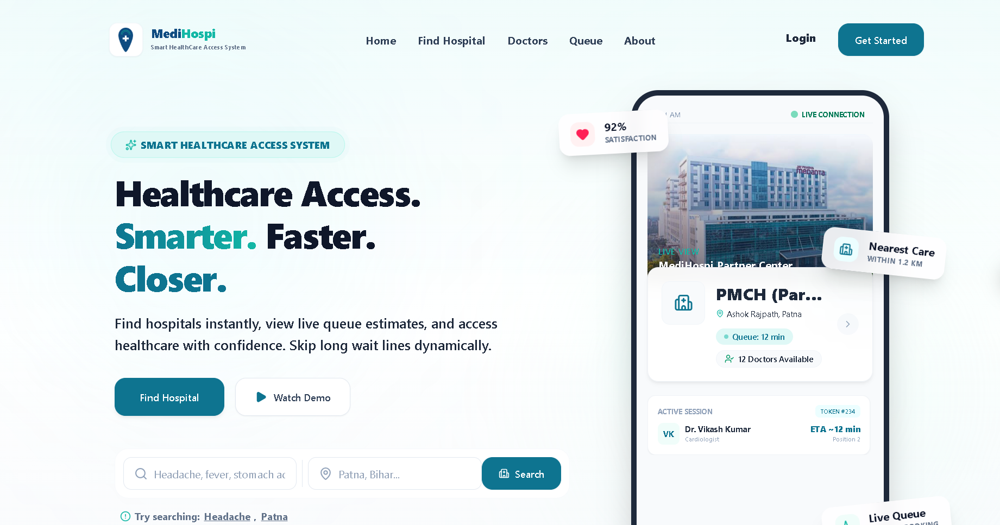

# 🏥 MedHospi — Smart Healthcare Access System

A production-grade healthcare access platform designed to reduce hospital waiting times through intelligent hospital discovery, symptom-based search, appointment booking, QR check-ins, real-time queue tracking, family member bookings, EMR workflows, and multi-role operational dashboards.

---

## 🌐 Live Deployment

### Frontend
https://smart-healthcare-access-system.vercel.app

### Backend API
https://smart-healthcare-access-system.onrender.com

---

## 📸 Platform Preview



---

## 🚨 Problem Statement

Traditional hospital systems suffer from:

- Long waiting queues
- No visibility into doctor availability
- No estimated consultation timings
- Difficult family member management
- Manual reception workflows
- Poor patient tracking visibility

Patients often spend hours waiting without knowing when they will be called.

---

## 💡 Solution

MedHospi introduces a modern healthcare access platform that provides:

- Intelligent hospital discovery
- Symptom-based search engine
- Dynamic queue estimation
- Real-time queue tracking
- QR-based patient check-ins
- Family member booking support
- EMR timeline management
- Multi-role hospital operations dashboard

---

# ✨ Core Features

## 👤 Patient Portal

- Symptom-based hospital discovery
- Appointment booking
- Live queue tracking
- QR check-ins
- Appointment reminders
- Medical history timeline
- Family profile management
- Family member bookings
- Notification center
- Saved hospitals

---

## 👨‍⚕️ Doctor Dashboard

- Call next patient
- View patient medical history
- Consultation management
- Prescription generation
- Visit completion workflow
- Follow-up scheduling

---

## 🏥 Reception Dashboard

- Walk-in patient management
- QR verification
- Appointment check-ins
- Booking transfers
- Queue management

---

## 🛠 Hospital Admin Dashboard

- Doctor management
- Receptionist management
- Hospital analytics
- Operational monitoring
- Workforce management

---

## 🔐 Super Admin Dashboard

- Platform health monitoring
- Security analytics
- Audit logs
- System-wide KPIs
- Incident management

---

# 👨‍👩‍👧 Family Management Center

Patients can:

- Add family members
- Book appointments on behalf of relatives
- Manage children and dependents
- Share medical access securely
- Receive mirrored notifications
- Manage caregiver permissions

Supported relationships:

- Child
- Parent
- Spouse
- Guardian
- Caregiver
- Dependent

---

# 📱 QR Check-In System

The platform supports:

- QR appointment generation
- Instant reception validation
- Contactless check-ins
- Queue activation
- Reduced reception congestion

---

# 🔔 Smart Notification Engine

Automatic reminders are sent:

- 1 hour before consultation
- 30 minutes before consultation
- 15 minutes before consultation

Notifications are mirrored to guardians when appointments belong to managed family members.

---

# 📊 Real-Time Queue Engine

Features include:

- Dynamic queue estimation
- Live queue updates
- Queue position tracking
- Session-aware doctor scheduling
- Automatic ETA recalculation

Powered by Socket.IO.

---

# 📈 Performance Optimizations

Implemented optimizations include:

- MongoDB indexing
- Query projection using `.select()`
- Lean queries using `.lean()`
- Response compression
- Bundle splitting
- Route lazy loading
- Memoized dashboard widgets
- Background workers
- Query timeout protection

---

# 🏗 System Architecture

```text
React + Vite Frontend
            │
            ▼
Express.js REST API Layer
            │
            ▼
MongoDB Database Layer
            │
            ▼
Socket.IO Realtime Engine
```

---

# ⚙️ Technology Stack

| Layer | Technology |
|------|-----------|
| Frontend | React, Vite, TailwindCSS |
| Backend | Node.js, Express.js |
| Database | MongoDB |
| Realtime | Socket.IO |
| Authentication | JWT, Google OAuth |
| Validation | Zod |
| Media Storage | Cloudinary |
| Security | Helmet, Rate Limiting |
| Scheduling | Node Cron |

---

# 🔐 Authentication Features

- Email & Password Authentication
- Google OAuth Login
- JWT Access Tokens
- Refresh Tokens
- Role-Based Access Control

---

# 👥 Supported Roles

| Role | Status |
|------|-------|
| Patient | ✅ |
| Doctor | ✅ |
| Receptionist | ✅ |
| Hospital Admin | ✅ |
| Super Admin | ✅ |

---

# 📂 Repository Structure

```text
smart-healthcare-access-system/
│
├── backend/
│   ├── src/
│   ├── scripts/
│   ├── seed/
│   ├── workers/
│   └── backups/
│
└── frontend/
    ├── src/
    ├── components/
    ├── modules/
    └── pages/
```

---

# 🚀 Local Development

## Clone Repository

```bash
git clone https://github.com/vikash-kumar-fullstack/smart-healthcare-access-system.git
```

## Backend

```bash
cd backend
npm install
npm run dev
```

## Frontend

```bash
cd frontend
npm install
npm run dev
```

---

# 🌱 Environment Variables

## Backend

```env
MONGO_URI=
JWT_SECRET=
JWT_REFRESH_SECRET=
GOOGLE_CLIENT_ID=
GOOGLE_CLIENT_SECRET=
GOOGLE_CALLBACK_URL=
CLIENT_URL=
CLOUDINARY_CLOUD_NAME=
CLOUDINARY_API_KEY=
CLOUDINARY_API_SECRET=
SMTP_EMAIL=
SMTP_PASSWORD=
```

## Frontend

```env
VITE_API_URL=
```

---

# 📊 Scalability Targets

The platform is designed to support:

- 500 concurrent bookings
- 200 concurrent check-ins
- 100 active doctor consultations
- 5000 WebSocket events
- 500+ registered patients
- 50+ doctors
- Multiple hospitals

---

# 🔮 Future Roadmap

- Redis Caching
- Docker Support
- Kubernetes Deployment
- AI Triage Assistant
- Insurance Integration
- Multi-region Deployment
- Telemedicine Support

---

# 👨‍💻 Author

**Vikash Kumar**

B.Tech Computer Science and Engineering  
National Institute of Technology Mizoram

GitHub:
https://github.com/vikash-kumar-fullstack

LinkedIn:
https://linkedin.com/in/vikash-kumar-fullstack

---

## ⭐ If you found this project useful, consider giving it a star.
